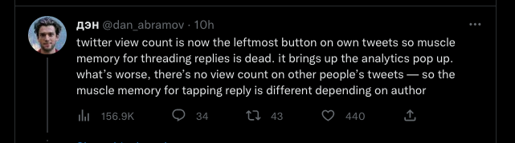

# Remove Analytics Button from Twitter UI uBlock Origin rule

Twitter has updated the UI, displaying the analytics of all tweets, and at the same time, they added the button at the beginning of the row, taking advantage of your muscle memory. This uBlock Origin rule will hide the new button and, at the same time, set the thread reply button at the beginning.

Before

After

Made with ❤️ by Said
